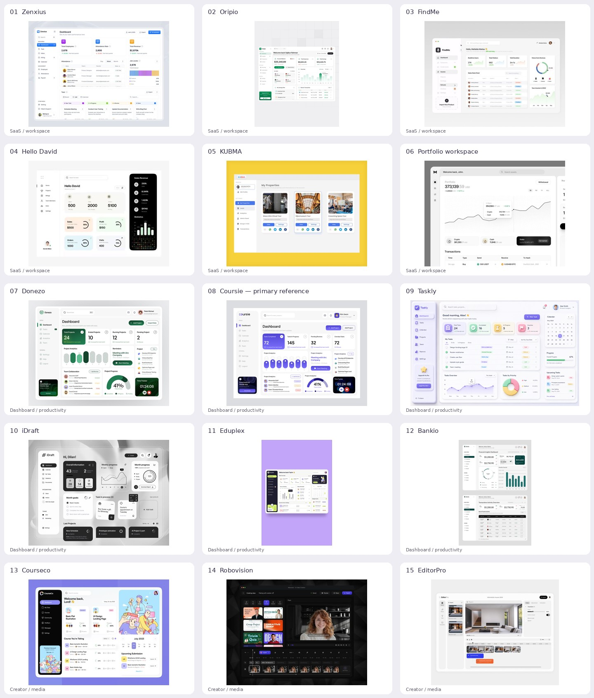

# Pinterest dashboard research

Researched on 5 October 2026 by three research agents: SaaS/workspace, dashboard/productivity, and creator/media. **15 distinct references were selected and visually inspected.** Fourteen have verified pin pages; EditorPro is an actual Pinterest search image whose public pin permalink was not exposed.

## Selected direction

**Coursie is the primary reference.** The implementation follows its inset, rounded sidebar and header, pale neutral workspace, white content surfaces, restrained violet, and prominent summary panel. Donezo reinforces the same design family. KUBMA, Courseco, and EditorPro inform thumbnail presentation and content hierarchy. ShortForge retains actual library data and working editing, importing, search, selection, theme, and settings flows.

Reference artwork is research material and is not bundled into the application. The dashboard contains no invented financial charts, media records, profile identities, or subscription offers. These UX observations describe static layout evidence rather than usability tests of the source products.

## Reference list

| # | Reference | Research area | Applied observation |
|---|---|---|---|
| 1 | [Zenxius](https://www.pinterest.com/pin/dashboard-design--624944885827729004/) · [image](https://i.pinimg.com/736x/7a/2d/c2/7a2dc29ba2ca5604cdbb03a313b492db.jpg) | SaaS / workspace | Grouped navigation and concise overview. |
| 2 | [Oripio](https://uk.pinterest.com/pin/saas-web-app-design--589690145003419085/) · [image](https://i.pinimg.com/736x/30/8d/9e/308d9e4a32060ff222d95922a7eefc8e.jpg) | SaaS / workspace | Aligned search, heading, and actions. |
| 3 | [FindMe](https://www.pinterest.com/pin/findme-minimalist-dashboard-redesign--462885667963443900/) · [image](https://i.pinimg.com/736x/56/34/06/563406e611570dda4227469d683a4e79.jpg) | SaaS / workspace | Quiet canvas and readable task hierarchy. |
| 4 | [Hello David](https://www.pinterest.com/pin/292452569560757182/) · [image](https://i.pinimg.com/736x/56/83/67/568367ede47a68b34209213fa264403b.jpg) | SaaS / workspace | One strong focal panel. |
| 5 | [KUBMA](https://au.pinterest.com/pin/minimal-dashboard-design--615163630351164319/) · [image](https://i.pinimg.com/736x/e5/a9/c7/e5a9c7d2288c1f71fe2326db9240e1c7.jpg) | SaaS / workspace | Thumbnail-first media cards and explicit actions. |
| 6 | [Portfolio workspace](https://au.pinterest.com/pin/676243700345136219/) · [image](https://i.pinimg.com/736x/02/e5/41/02e5419672345525f7ec10f97503c9dc.jpg) | SaaS / workspace | Fine dividers and consistent spacing. |
| 7 | [Donezo](https://www.pinterest.com/pin/35254809577482776/) · [image](https://i.pinimg.com/originals/e4/b5/8c/e4b58c5d1c363d3a7223476d657d0f79.png) | Dashboard / productivity | Accented overview card and pale content well. |
| 8 | [Coursie](https://www.pinterest.com/pin/304626362318839469/) · [image](https://i.pinimg.com/originals/8e/38/8a/8e388a8d275d7fbd9019f29bbe073ec0.png) | Dashboard / productivity | PRIMARY: violet, inset rounded shell, white working surfaces. |
| 9 | [Taskly](https://www.pinterest.com/pin/42854633949843939/) · [image](https://i.pinimg.com/originals/1f/e4/df/1fe4df244bca59198bcfca18f7e8648d.png) | Dashboard / productivity | Filters and written states beside the work. |
| 10 | [iDraft](https://www.pinterest.com/pin/785455991311895862/) · [image](https://i.pinimg.com/originals/f6/86/aa/f686aa16cd9f8367f110f024a3c5757b.png) | Dashboard / productivity | Creation action and consistent recent-project controls. |
| 11 | [Eduplex](https://www.pinterest.com/pin/1477812372350738/) · [image](https://i.pinimg.com/originals/39/b8/0d/39b80d90c8f7585cce93b1e3ad0defee.jpg) | Dashboard / productivity | Content metadata and supporting information. |
| 12 | [Bankio](https://www.pinterest.com/pin/148126275239748454/) · [image](https://i.pinimg.com/originals/1e/a0/9e/1ea09e7dad4ba76329eeb9172dbe4842.jpg) | Dashboard / productivity | Readable tables, written status, and quiet dividers. |
| 13 | [Courseco](https://id.pinterest.com/pin/1128714725392184328/) · [image](https://i.pinimg.com/736x/b4/e2/e2/b4e2e279c4592f3dc639ff4fa4b5b7f3.jpg) | Creator / media | Content-led hierarchy and concise metadata. |
| 14 | [Robovision](https://www.pinterest.com/pin/416231190587216444/) · [image](https://i.pinimg.com/736x/b6/73/88/b673888a2bf9b4259e844d629581f9de.jpg) | Creator / media | Video thumbnail grids and creation controls. |
| 15 | [EditorPro](https://www.pinterest.com/search/pins/?q=video%20dashboard%20ui) · [image](https://i.pinimg.com/736x/30/0f/f5/300ff5386413c6edf71f9fc563c712f7.jpg) | Creator / media | Calm media wells; footage carries the visual weight. |

## Retrieval notes

Direct Pinterest search returned a signed-out JavaScript shell. The agents used indexed Pinterest results, Pinterest's [Dashboard Design topic](https://www.pinterest.com/topics/dashboard-design/), and the publicly rendered [video-dashboard search](https://www.pinterest.com/search/pins/?q=video%20dashboard%20ui) to obtain actual pin pages and image URLs. Selected images were downloaded and visually inspected. Irrelevant and duplicate results were excluded.

Coursie's saved pin title is “Corporate Website”; its image identifies the product as Coursie. Robovision's fetched pin identifies [1123437069579125613](https://in.pinterest.com/pin/1123437069579125613/) as its canonical page. EditorPro is identified by its visible product name and image hash `300ff5386413c6edf71f9fc563c712f7`; no pin ID was invented.

The [machine-readable list](pinterest-dashboard-references.json) retains source URLs. Full reports: [SaaS and workspace](research-saas.md), [dashboard and productivity](research-dashboard.md), [creator and media](research-creator.md).
